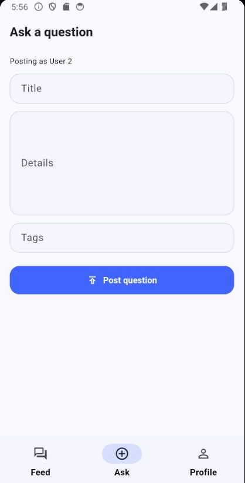
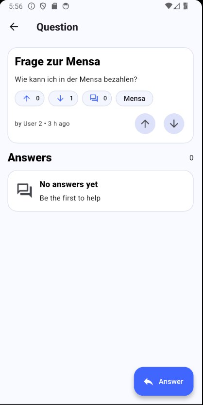
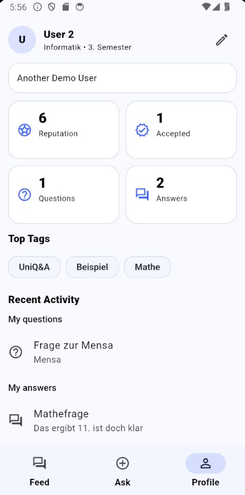

# Uni Q&A Mobile App
*A cross-platform mobile app developed using Flutter Framework with a target group of **students/pupils**.*

[](https://flutter.dev)
[](https://dart.dev)
[](LICENSE)

## ✨ Features

| Feature | Description | Emoji |
|---------|-------------|-------|
| **Smart Feed** | Questions displayed in familiar infinite-scroll format with sorting options | 📱 |
| **Voting System** | Upvote/downvote questions and answers to surface best content | ⬆️⬇️ |
| **Real-time Q&A** | Post questions, provide answers, and add explanations | 💬 |
| **User Statistics** | Track your engagement with detailed activity metrics | 📊 |
| **Clean Navigation** | Flat hierarchy with all core features one tap away | 🎯 |
| **Cross-platform** | Works on iOS, Android, and web from single codebase | 🔄 |
 
## 🚀 Workflow
1. **Brainstorming** - started with a bunch of random ideas(wild ideas were encouraged).
2. Consulting with other independent people, who gave their feedback and opinion on their favourite app concept.
3. The development team weighed up all the advantages and disadvantages of the app in light of the feedback from the people who were asked, and finally started building on the chosen idea.
4. **Prototyping** - the rough idea was drew on paper(details were missing).
5.  After consulting with potential future users of the app again, some functions were scrapped and others were finalised (the design underwent some changes).
6. The **final prototype** was created.
7. **Coding** - The paper prototype was converted to code.
8. **Testing & Bug fixing** - All the functionalities and features were tested and some bugs were successfully fixed.

> More detailed information about the whole process can be found in this **[document](./Lab5_dossier.docx)**.
<br><br>

## 📱 App Screenshots
| Main Feed | Post Question | Question Details | User Profile |
|-----------|---------------|------------------|--------------|
|  |  |  |  |

## 📂 Project Structure
``` plaintext
uni-qa-mobile-app/
├─ android/
├─ ios/
├─ lib/
│  ├─ app/
│  │  ├─ app_state.dart
│  │  ├─ app.dart
│  │  └─ root_shell.dart
│  ├─ data/
│  │  └─ qna_repository.dart
│  ├─ models/
│  │  ├─ answer.dart
│  │  ├─ app_user.dart
│  │  ├─ feed_sort.dart
│  │  └─ question.dart
│  ├─ screens/
│  │  ├─ add_answer_screen.dart
│  │  ├─ ask_question_screen.dart
│  │  ├─ feed_screen.dart
│  │  ├─ login_screen.dart
│  │  ├─ profile_screen.dart
│  │  └─ question_detail_screen.dart
│  ├─ utils/
│  │  ├─ snack.dart
│  │  └─ time_ago.dart
│  ├─ widgets/
│  │  ├─ answer_card.dart
│  │  ├─ empty_box.dart
│  │  ├─ mini_chip.dart
│  │  ├─ question_card.dart
│  │  └─ stat_tile.dart
│  └─ main.dart
├─ linux/
├─ macos/
├─ web/
├─ windows/
├─ .gitignore
├─ .metadata
├─ analysis_options.yaml
├─ Lab5_dossier.docx
├─ pubspec.lock
├─ pubspec.yaml
└─ README.md
```

## How to build and run?
### 1. Prerequisites:
   - Download & Install Flutter SDK.
   - Any text editor, though VS Code or Android Studio is recommended.
   - A connected physical device or a running emulator/simulator to run the app on.
  
```
flutter doctor        // verify your setup is correct
```
### 2. Open project folder in your workspace
### 3. Get Dependencies:
```
flutter pub get      // Before running the app for the first time, fetch all the necessary dependencies and packages
```
### 4. Run the Project
```
flutter run     // build and launch the app on a connected device or emulator
```

## 📄 License

> This project is licensed under Personal License - see the **[LICENSE](LICENSE)** file for details.
